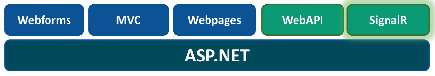
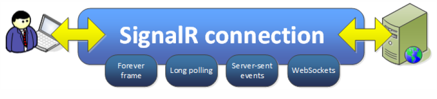

SignalR
=====
What is it?
-----------
We are often faced with scenarios where the server needs to initiate the push. What's being used?
* __Polling__: It's easy to implement and it's universal since it uses
standard features of HTTP.  However, it's still the Pull model, and it lacks an immediate response.
* __Long polling__: Similar to Polling, but the connections remains open until the server has something to notify or a timeout occurs.
* __Forever frame__: It uses an HTML <iframe> tag to obtain a permanently open connection.  This technique uses HTML, JavaScript, and HTTP.  
No time is wasted in the connection and disconnection processes. Timeouts, proxies and firewalls are problematic. Responses would accumulate in the iframe in client memory that could result in too much RAM usage.

####SignalR arrives at the scene####

SignalR is an ASP.NET library that allows developers to add real-time web functionality to their applications. 
Real-time web functionality is essentially pushing server-side content to the client as it happens (thus "real-time"). 
Example: Two users are viewing the same screen in an application. Some of the data that is presented to the client is stored in a database.
If one user were to perform a transaction in the database through server-side code, the other user wouldn't be able to see the change on their 
screen until they refreshed their browser window. With SignalR, after the database transformation is complete the updated content can be 
pushed up to each user currently on the application so they can see the changes right as they happened.

Originally it was a personal project of David Fowler and Damian Edwards, members of the ASP.NET team at Microsoft, but it is now an officially integrated product in the stack of Web technologies.

SignalR includes a set of transports (or techniques) to keep the underlying connection to the server open—“as standard”.
It determines which transport it should use based on certain factors, such as the availability of the technology at both 
ends. __SignalR will always try to use the most efficient transport__, and will keep falling back until it finds one that 
is compatible with the context.  

How to use it?
--------------
SignalR requires a hub that is setup on both the client-side javascript and server-side code. The hub connection is started on
the client-side (wherever the developer wants to put the connection start, it can be after a user logs in or even right when they open
the application in their browser). The server-side requires a hub class that inherits from the SignalR Host class. As long as the 
class name matches the client-side hub name, communication between the client and server-side hubs can begin. 
Each user has their own unique hub identified by a ConnectionId, but SignalR has access to all hubs currently connected to the application. 
Developers can also access the server-side hub from anywhere in their code by retrieving the hub context. WIth the hub 
context, developers can push content to clients from anywhere in their code.

Examples
--------
[ShootR game] (http://shootr.signalr.net/) 
[Jabb chat] (https://jabbr.net/account/login?ReturnUrl=https%3A%2F%2Fjabbr.net%2F)

Demo
----
[Quality Bank] (https://github.com/ResourceDataInc/QualityBank) 
[Scrumtools on Intranet] (https://github.com/ResourceDataInc/Intranet)

Resources
--------
[ASP.NET](http://www.asp.net/signalr)  
[Scott Hanselman] (http://www.hanselman.com/blog/AsynchronousScalableWebApplicationsWithRealtimePersistentLongrunningConnectionsWithSignalR.aspx)  
[Mira Javora Blog Quick Chat App] (http://blog.mirajavora.com/signalr-introduction-to-signalr-quick-chat-app) 
[SignalR book] (./files/SignalR Book - JM Aguilar - campusMVP.net.pdf)
